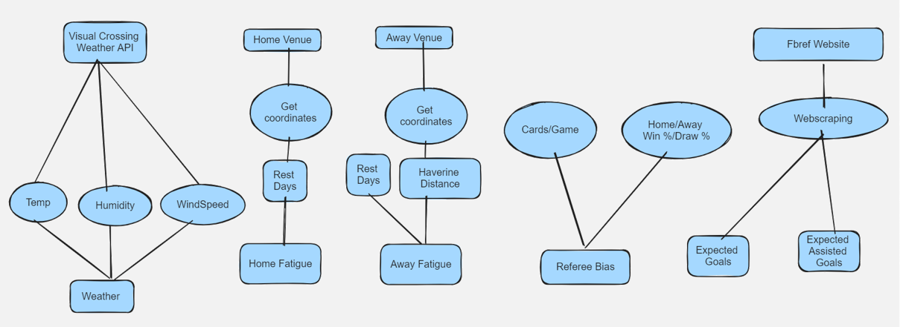

# Predicting Football Match Outcomes Using Advanced Football Metrics

## Introduction

This project aims to predict football match outcomes using metrics like Expected Goals (xG) and Expected Assisted Goals (xAG) with external factors such as weather conditions, referee bias, and team fatigue .

### Data Collection

Data was collected from multiple sources, including match statistics, weather data, and referee reports. This involved scraping data from APIs and compiling historical match records from online databases.

###Model Metrics

Please click the following link to view the logged metrics of Random Forest model in mllow UI.

