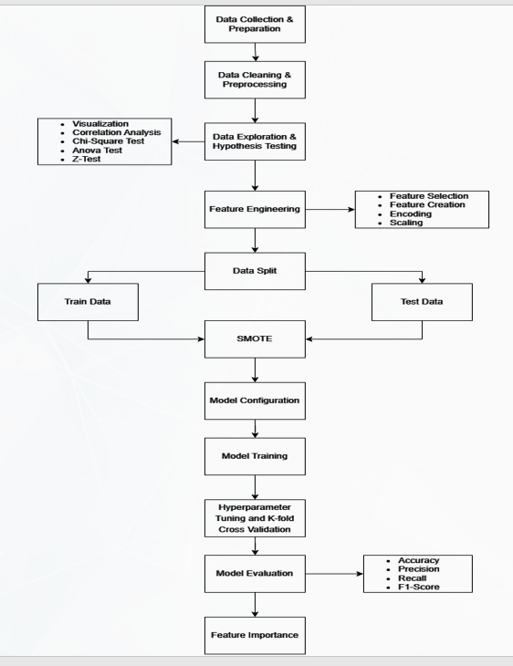

# Predicting Football Match Outcomes Using Advanced Football Metrics


## Table of Contents

- [Introduction](#introduction)
- [Methodology](#methodology)
- [How to Run the Project](#how-to-run-the-project)


## Introduction

This project aims to predict football match outcomes using advanced football metrics and machine learning models. By combining metrics like Expected Goals (xG) and Expected Assisted Goals (xAG) with external factors such as weather conditions, referee bias, and team fatigue, we aim to achieve high prediction accuracy.

## Methodology

### Proposed System Diagram

Our system consists of several key components: data collection, data preparation, exploratory data analysis, model implementation, and evaluation.



### Data Collection

Data was collected from multiple sources, including match statistics, weather data, and referee reports. This involved scraping data from APIs and compiling historical match records from online databases.


### Data Preparation

Data preparation involved cleaning and preprocessing the raw data. Feature engineering was applied to create new variables such as home/away fatigue levels and referee bias scores.

## Model Implementation

### Machine Learning Algorithms

We implemented several machine learning algorithms to predict match outcomes:
- Linear Support Vector Classifier (Linear SVC)
- Logistic Regression
- Random Forest Classifier
- K-Nearest Neighbor (KNN)
- Stacking Classifier

## Model Evaluation

### Evaluation Metrics

Models were evaluated using the following metrics:
- Accuracy
- Precision
- Recall
- F1 Score

### Results

The Random Forest Classifier achieved the highest accuracy of 90.3%. The confusion matrix below shows the performance of the Random Forest model:


### Feature Importance

Feature importance analysis revealed that xG and xAG were the most significant predictors of match outcomes, with weather conditions and referee bias also having a notable impact.


## How to Run the Project

1. Clone the repository:
    ```bash
    git clone https://github.com/your_username/football-match-prediction.git
    ```
2. Navigate to the project directory:
    ```bash
    cd football-match-prediction
    ```
3. Install the required dependencies:
    ```bash
    pip install -r requirements.txt
    ```
4. Run the data collection script:
    ```bash
    python data_collection.py
    ```
5. Run the data preparation script:
    ```bash
    python data_preparation.py
    ```
6. Train the models:
    ```bash
    python model_training.py
    ```
7. Evaluate the models:
    ```bash
    python model_evaluation.py
    ```

## Acknowledgements

This project was inspired by the need to leverage advanced football metrics and machine learning for predictive analytics. We acknowledge the sources of our data, including public APIs and online football databases.
